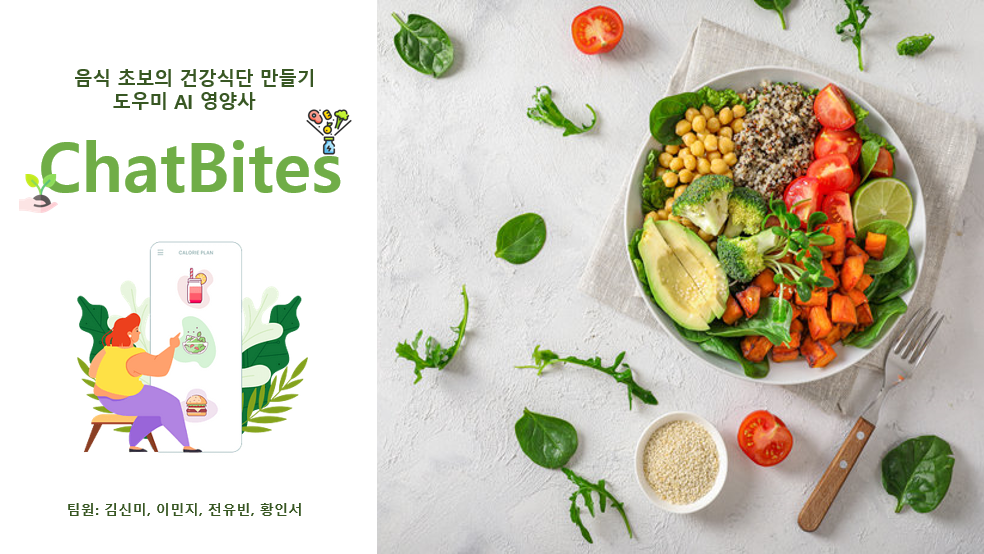
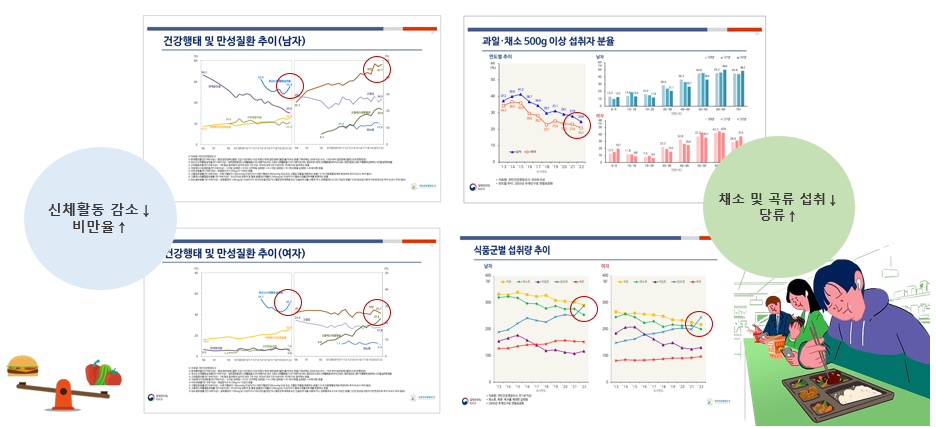
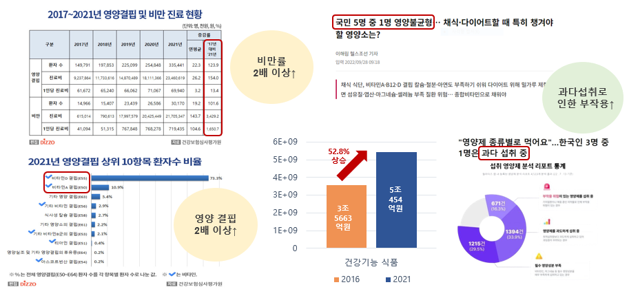
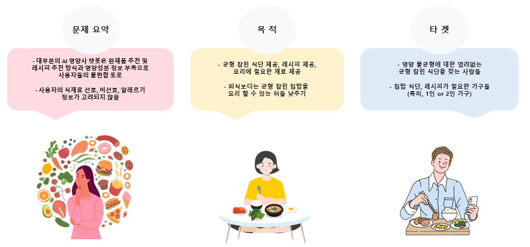
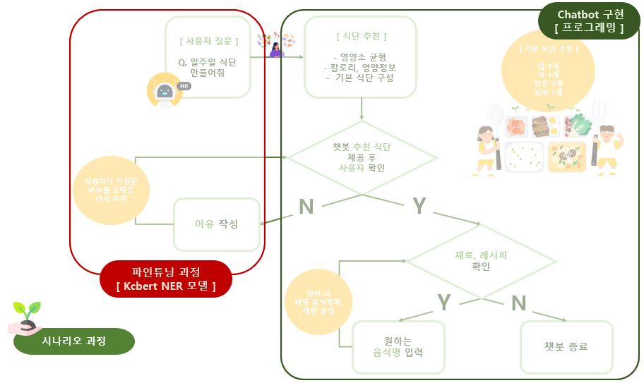
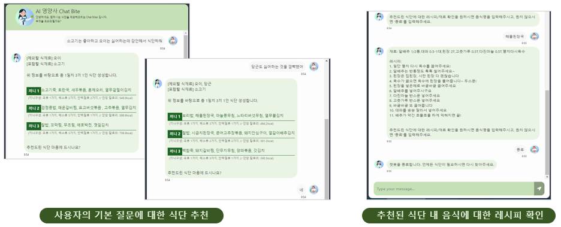
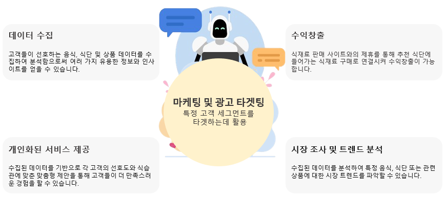

    

## 1. 기획 의도
#### * 현대인들의 신체활동 감소로 인한 비만율 상승
#### * 채소 및 곡류 섭취 감소 및 당류 섭취 상승에 의한 '비만'과 '영양 결핍'의 심화라는 역설적 상황 발생
&#160; &#160; &#160; - 원인 : 육식과 탄수화물에 편중된 식단, 야외 활동 감소, 자극적인 음식 선호, 극단적 다이어트 등 
&#160; &#160; &#160; - '배부른 영양실조' 유발, 개인적 특성과 환경에 따른 부족 영양소의 차별성 발생 
&#160; &#160; &#160; - 부족 영양소에 대한 영양제 과다 섭취에 의한 부작용 발생 
 
    

## 2. 프로젝트 개요
    

## 3. 웹 구성도
 
#### 1) 파인튜닝 과정 : 데이터 크롤링 > 데이터 전처리를 통한 토큰화 및 태그 처리 > Train 데이터셋을 통한 모델 훈련 > &#160; &#160; &#160; &#160; &#160; &#160; &#160; &#160; &#160; &#160; &#160; &#160; &#160; &#160; Bert 모델 파인튜닝 > Test 데이터셋을 통한 모델 검증
&#160; &#160; &#160; - 데이터 크롤링 : BeautifulSoup 활용 > Selenium 활용 
&#160; &#160; &#160; &#160; &#160; &#160; &#160; &#160; &#160; &#160; &#160; &#160; &#160; &#160; &#160; &#160; &#160; (이유 : 중 동적 웹 페이지에서 데이터를 수집을 위한 자동화된 크롤링 수행) 
&#160; &#160; &#160; - 데이터 수집 대상 : 아하(https://www.a-ha.io/, 건강식단 관련 전문가 답변 분야), 
&#160; &#160; &#160; &#160; &#160; &#160; &#160; &#160; &#160; &#160; &#160; &#160; &#160; &#160; &#160; &#160; &#160; &#160; &#160; 네이버 지식인(https://kin.naver.com/, 사용자 플랫폼 1위), 
&#160; &#160; &#160; &#160; &#160; &#160; &#160; &#160; &#160; &#160; &#160; &#160; &#160; &#160; &#160; &#160; &#160; &#160; &#160; 만개의 레시피(https://www.10000recipe.com/, 요리 재료 및 레시피, 요리 난이도 활용), 
&#160; &#160; &#160; &#160; &#160; &#160; &#160; &#160; &#160; &#160; &#160; &#160; &#160; &#160; &#160; &#160; &#160; &#160; &#160; 보건복지부 및 식품의약품안전처 등 
&#160; &#160; &#160; - 데이터 수집 방법  
&#160; &#160; &#160; &#160; &#160; &#160; - [수작업 영역] 크롤링 결과 데이터의 분류 확인, 질문에 대한 데이터 토큰화 및 태그화 
&#160; &#160; &#160; &#160; &#160; &#160; &#160; &#160; &#160; &#160; &#160; &#160; &#160; &#160; &#160; &#160; &#160; &#160; (초기 전처리로 1000여개의 데이터 선별 후, 
&#160; &#160; &#160; &#160; &#160; &#160; &#160; &#160; &#160; &#160; &#160; &#160; &#160; &#160; &#160; &#160; &#160; &#160; &#160; 추가 선별 및 수정을 통해 561개의 학습용 데이터 생성) 
&#160; &#160; &#160; &#160; &#160; &#160; - [학습 데이터 증강] GPT API 프롬프트를 사용 (561개의 학습 데이터를 약 1000개로 증강) 
#### 2) Chatbot 구현 : Ubuntu기반의 Flask와 Bootstrap을 이용한 Chatbot 화면 개발
    

## 4. 기대 효과
    

## 5. 프로젝트 결과 아쉬운 점 및 개선방향 (추가 업데이트 구상부분)

&#160; &#160; &#160; &#160; &#160; - 코드의 간결화 및 객체화 : 데이터 모델 구현 및 활용에 대한 이해도 부족 
&#160; &#160; &#160; &#160; &#160; - 사용자 질문 형식의 정형화 
&#160; &#160; &#160; &#160; &#160; &#160; : 사용자 질문 형식의 정해진 규정을 따르지 않을 경우, 선호/비선호 식재료 인식에의 오류 발생 
&#160; &#160; &#160; &#160; &#160; &#160; &#160; (질문형식에의 규정 : 식재료간의 구분은 컴마(,)로 해야 함, 지정 범위 외 조사 사용 등) 
&#160; &#160; &#160; &#160; &#160; - 기존 등록된 식재료의 재입력시 식재료 중복현상 발생 
&#160; &#160; &#160; &#160; &#160; - 화면 새로고침시 기존 등록된 식재료가 초기화 되지 않음.

